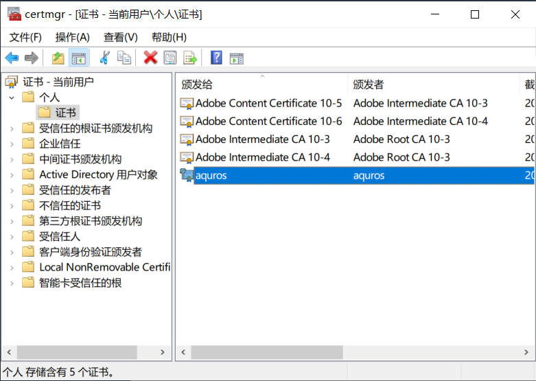

# PIV on K9+

## 开始之前需要知道的

PIV有三个PIN（和PGP不同），在开始使用前最好进行修改并牢记

在飞天官方程序左侧选择`Applications - PIV`，右侧分别点击`Change PIN`、`Change PUK`、`Change Manager Key`进行修改，**注意`Manager Key`是48位数字**

程序内置了默认值，如果没有修改过，勾选`Use Default`可以自动填入默认值

PIN相关介绍在首页

## 生成证书

打开`Applications - PIV`，右侧的`Slot`中选择一个无证书的空槽位，点击`Generate`进行生成

如果想要使用证书做SSH认证，请尽量使用`RSA(2048 bits)`算法，兼容性更好

生成之后可以使用`Export`导出证书并保存

## 验证证书生成成功

在插着key的情况下打开`certmgr.msc`，选择`个人-证书`，可以查看刚刚生成的证书

## SSH with PIV

[SSH on K9+](https://github.com/AsterisMono/ftsafe-k9plus-user-guide/blob/main/guides/ssh.md)
