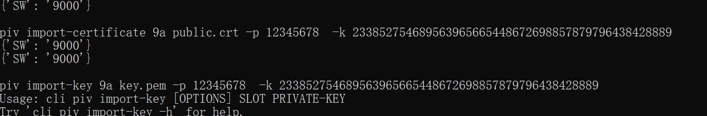
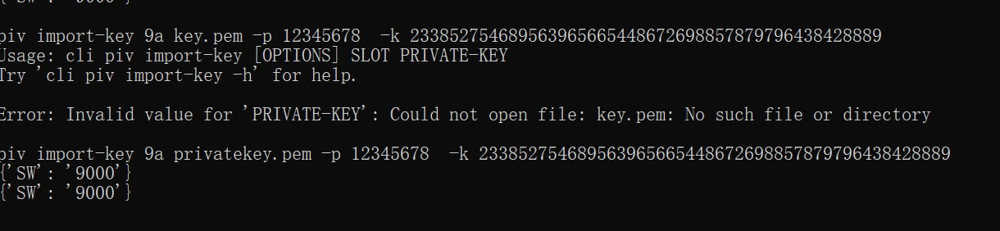

# PIV on K9+

## 开始之前需要知道的

PIV有三个PIN（和PGP不同），在开始使用前最好进行修改并牢记

在飞天官方程序左侧选择`Applications - PIV`，右侧分别点击`Change PIN`、`Change PUK`、`Change Manager Key`进行修改，**注意`Manager Key`是48位数字**

程序内置了默认值，如果没有修改过，勾选`Use Default`可以自动填入默认值

PIN相关介绍在首页

关于证书Slot：[Certificate Slots](https://developers.yubico.com/PIV/Introduction/Certificate_slots.html)

## 使用官方工具生成证书（无法导出私钥）

打开`Applications - PIV`，右侧的`Slot`中选择一个无证书的空槽位，点击`Generate`进行生成

如果想要使用证书做SSH认证，请尽量使用`RSA(2048 bits)`算法，兼容性更好

生成之后可以使用`Export`导出证书并保存

## 验证证书生成成功

> 需要补充验证：我这里看到的证书很奇怪

在插着key的情况下打开`certmgr.msc`，选择`个人-证书`，可以查看刚刚生成的证书


或者…

## 自行生成Key

安装[OpenSSL](https://slproweb.com/products/Win32OpenSSL.html)。

将OpenSSL安装目录下的`bin`文件夹添加到环境变量，或`cd`到该目录下。

运行` openssl req -x509 -sha256 -nodes -days 365 -newkey rsa:2048 -keyout cert.key -out cert.crt`

```
-----
You are about to be asked to enter information that will be incorporated
into your certificate request.
What you are about to enter is what is called a Distinguished Name or a DN.
There are quite a few fields but you can leave some blank
For some fields there will be a default value,
If you enter '.', the field will be left blank.
-----
Country Name (2 letter code) [AU]:CN # 国家，可不写
State or Province Name (full name) [Some-State]:
Locality Name (eg, city) []:
Organization Name (eg, company) [Internet Widgits Pty Ltd]:
Organizational Unit Name (eg, section) []:
Common Name (e.g. server FQDN or YOUR name) []:test # 这里写的东西会显示在"颁发给"和"颁发者"位置
Email Address []:
```

## 导入自己生成的Key

> Credit：@Jerry Zhao

使用飞天官方程序安装目录里的`ftman_manager.exe`。

> 这个程序启动之后不会显示出任何提示符，不要以为它卡了，直接打命令就行

导入私钥：`piv import-key SLOT example.key -p PIN -k MKEY`

导入证书：`piv import-certificate SLOT example.crt -p PIN -k MKEY`





## SSH with PIV

[SSH on K9+](https://github.com/AsterisMono/ftsafe-k9plus-user-guide/blob/main/guides/ssh.md)

