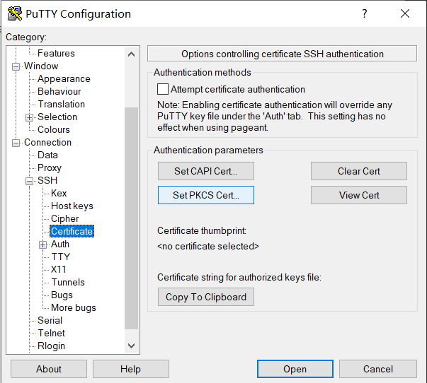

# SSH on K9+

## 开始之前需要知道的

使用K9+进行SSH认证有两种方法：基于`PIV`，或者基于`PGP`。

无论你选择采用哪种，在开始之前，**请确保已经配置好对应的证书/密钥。**

## 基于PIV的SSH认证

这种配置起来相对简单，不需要替换`SSH Agent`。

> Credit：[使用PGP智能卡登录SSH](https://www.yuque.com/benital/gnuk/bxacxf)

在开始之前，安装[OpenSC](https://github.com/OpenSC/OpenSC/releases)、[Putty-CAC](https://github.com/NoMoreFood/putty-cac/releases)。

插入K9+，在命令行输入`pkcs15-tool --dump`查看卡内证书信息：

> 如果你使用Windows，请先cd到`C:\Program Files\OpenSC Project\OpenSC\tools`

找到如下条目，记录其中的`ID`项

```
X.509 Certificate [Certificate for PIV Authentication]
        Object Flags   : [0x00]
        Authority      : no
        Path           :
        ID             : 01
        Encoded serial : 02 14 7ECF8D7AAC5839C456765C6813C020C723559F3C
```

导出SSH公钥：`pkcs15-tool --read-ssh-key ID`

将导出的公钥上传到Linux主机备用。

打开`Putty-CAC`，选择`SSH-Certificate-Set PKCS Cert`:



在弹出的选择框中找到`C:\Program Files\OpenSC Project\OpenSC\pkcs11\opensc-pkcs11.dll`，然后选择想要使用的证书：

> 如果在选择DLL的时候报错，检查自己的`Putty-CAC`位数和`OpenSC`位数是否相符


然后正常使用`Putty`进行连接即可。

## 基于PGP的SSH认证

TBD
